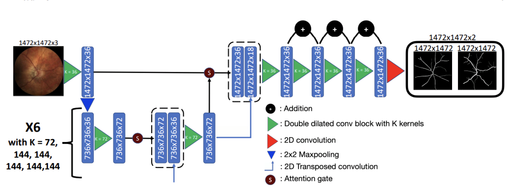

[](https://iopscience.iop.org/article/10.1088/1361-6579/ad3d28/meta)
[](https://apps.apple.com/fr/app/lirot-ai/id6478242092)


<h1 align="center">
  <br>
LUNet: deep learning for the segmentation of arterioles and venules in high resolution fundus images  <br>
</h1>
<p align="center">
  <a>Jonathan Fhima</a> •
  <a>Jan Van Eijgen</a> •
  <a>Marie-Isaline Billen Moulin-Romsée</a> •
  <a>Heloïse Brackenier</a>•
  <a>Hana Kulenovic</a> 

  <p align="center">
  <a>Valérie Debeuf</a> 
  <a>Marie Vangilbergen</a>•
  <a>Moti Freiman</a>•
  <a>Ingeborg Stalmans</a>•
  <a>Joachim A Behar</a>
</p>



### Installation

First, clone this repository and run install the environment:
```bash
cd LUNet
python -m venv lunet_env
source lunet_env/bin/activate
pip install -r requirements.txt
```

### Data preparation
Download the UZLF (aka Leuven-Haifa) dataset from the official website (https://rdr.kuleuven.be/dataset.xhtml?persistentId=doi:10.48804/Z7SHGO), and organize it as follows:
   
    LUNet
    ├── Databases
    │   ├── UZLF_TRAIN
    │   │   ├── images
    │   │   ├── artery
    │   │   ├── veins
    │   ├── UZLF_VAL
    │   │   ├── images
    │   │   ├── artery
    │   │   ├── veins
    │   ├── UZLF_TEST
    │   │   ├── images
    │   │   ├── artery
    │   │   ├── veins

After install the external datasets from PVBM (https://pvbm.readthedocs.io/) using the following commands:
```bash
cd LUNet
source lunet_env/bin/activate
python -u install_pvbm_datasets.py
```

### Training

Run the following command:
(Original LUNet model have been trained using 8 A100-40gb GPUs and have been trained with a slightly different version of the UZLF dataset which can explain minor differences in performance).
```bash
cd LUNet
source lunet_env/bin/activate
python -u main.py Databases/ lunet_model
```

### Evaluation
Run with test-time data augmentation (higher performance):
```bash
cd LUNet
source lunet_env/bin/activate
python -u eval_all.py Databases/ lunet_model --use_TTDA --datasets_test UZLF_VAL UZLF_TEST CropHRF INSPIRE
#Remove --use_TTDA if you dont want to use test time data augmentation during inference
#You can change the list of the test dataset
```

Run without test-time data augmentation (faster inference):
```bash
cd LUNet
source lunet_env/bin/activate
python -u eval_all.py Databases/ lunet_model --datasets_test UZLF_VAL UZLF_TEST CropHRF INSPIRE
```
### Main Results

<table>
  <tr>
    <th rowspan="2">Method</th>
    <th colspan="2">UZLF test</th>
    <th colspan="2">LES-AV</th>
    <th colspan="2">INSPIRE-AVR</th>
    <th colspan="2">Cropped HRF</th>
  </tr>
  <tr>
    <th>Artery</th>
    <th>Vein</th>
    <th>Artery</th>
    <th>Vein</th>
    <th>Artery</th>
    <th>Vein</th>
    <th>Artery</th>
    <th>Vein</th>
  </tr>
  <tr>
    <td>LUNet</td>
    <td>82.0</td>
    <td>84.5</td>
    <td>82.3</td>
    <td>84.8</td>
    <td>73.6</td>
    <td>77.5</td>
    <td>78.1</td>
    <td>80.4</td>
  </tr>
</table>

### LICENSE
This project is licensed under the [Creative Commons Attribution-NonCommercial 4.0 International License](LICENSE), which prohibits commercial use.


### Citation
If you find this code or data to be useful for your research, please consider citing the following papers.
    
    @article{fhima2024lunet,
        title={LUNet: deep learning for the segmentation of arterioles and venules in high resolution fundus images},
        author={Fhima, Jonathan and Van Eijgen, Jan and Moulin-Roms{\'e}e, Marie-Isaline Billen and Brackenier, Helo{\"\i}se and Kulenovic, Hana and Debeuf, Val{\'e}rie and Vangilbergen, Marie and Freiman, Moti and Stalmans, Ingeborg and Behar, Joachim A},
        journal={Physiological Measurement},
        volume={45},
        number={5},
        pages={055002},
        year={2024},
        publisher={IOP Publishing}
    }

    @article{van2024leuven,
        title={Leuven-Haifa High-Resolution Fundus Image Dataset for Retinal Blood Vessel Segmentation and Glaucoma Diagnosis},
        author={Van Eijgen, Jan and Fhima, Jonathan and Billen Moulin-Roms{\'e}e, Marie-Isaline and Behar, Joachim A and Christinaki, Eirini and Stalmans, Ingeborg},
        journal={Scientific Data},
        volume={11},
        number={1},
        pages={257},
        year={2024},
        publisher={Nature Publishing Group UK London}}

    @InProceedings{10.1007/978-3-031-25066-8_15,
        author="Fhima, Jonathan and Eijgen, Jan Van and Stalmans, Ingeborg and Men, Yevgeniy and Freiman, Moti and Behar, Joachim A.",
        title="PVBM: A Python Vasculature Biomarker Toolbox Based on Retinal Blood Vessel Segmentation",
        booktitle="Computer Vision -- ECCV 2022 Workshops",
        year="2023",
        publisher="Springer Nature Switzerland",
        address="Cham",
        pages="296--312",
        isbn="978-3-031-25066-8"
        }


    
